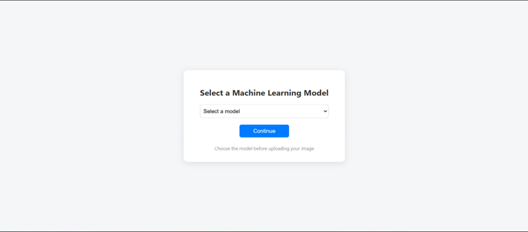
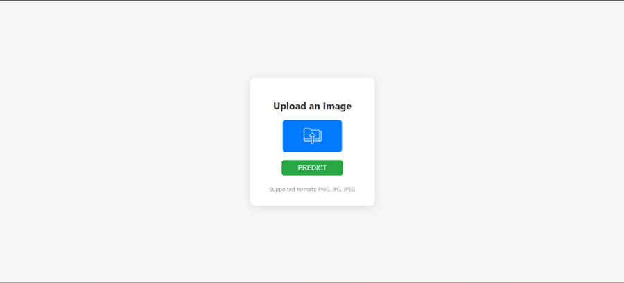
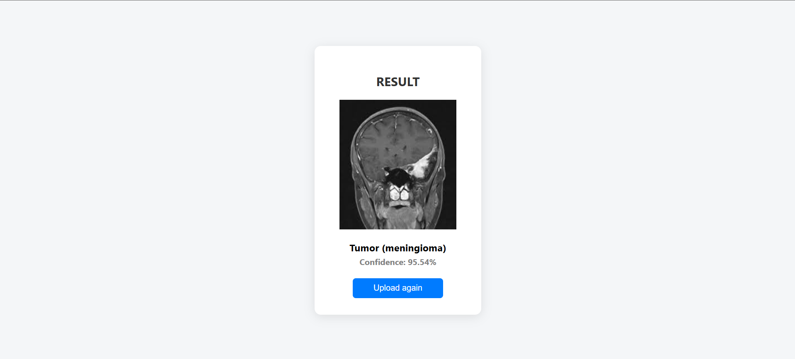

# Braintumor-ML-Integrated-WebApp

Brain Tumor Detection using Transfer Learning Models and Flask Web Application. <br>
Brain Tumor Detection using Transfer Learning Models and Flask Web Application <br>

This project proposes an end-to-end brain tumor classification system using deep learning models integrated within a Flask-based web application. The project leverages the power of transfer learning through four prominent CNN architectures: VGG16, VGG19, ResNet50, and InceptionV3. These models are trained on a labeled dataset of brain MRI images to classify them into four categories: glioma, meningioma, pituitary tumor, and no tumor. The final system allows users to upload an image and get real-time predictions. The project aims to support radiologists and healthcare professionals in making fast and accurate diagnostic decisions. <br>

### Problem Statement
Brain tumors pose a severe threat to human life and require early and accurate diagnosis for effective treatment. Manual analysis of MRI scans is labor-intensive and can lead to diagnostic errors due to human limitations.

### Objective
To build a deep learning-based classification system capable of accurately identifying brain tumor types from MRI scans and deploy it via a user-friendly Flask web application.

### Motivation
Deep learning provides powerful techniques for medical image analysis. Automating tumor detection helps reduce the burden on healthcare professionals, ensures consistent predictions, and aids in early diagnosis, especially in resource-constrained settings.


## Directory Structure

```md
Directory structure:
└── braintumor-ml-integrated-webapp/
    ├── README.md
    ├── app.py
    ├── requirements.txt
    ├── models/
    │   ├── inceptionv3_model.h5
    │   ├── resnet50_model.h5
    │   ├── vgg16_model.h5
    │   └── vgg19_model.h5
    ├── static/
    │   ├── scripts/
    │   │   └── upload.js
    │   ├── styles/
    │   │   ├── error.css
    │   │   ├── global.css
    │   │   ├── result.css
    │   │   ├── style.css
    │   │   └── upload.css
    │   └── uploads/
    │       └── .gitkeep
    └── templates/
        ├── error.html
        ├── index.html
        ├── result.html
        └── upload.html

```

## ML Model Repository

<a href="https://github.com/Samal-Ayush/BrainTumorClassification"></a>

## Tech Stack

- **Frontend**: HTML, CSS, JavaScript
- **Backend**: Python (Flask)
- **Templating Engine**: Jinja2
- **Rendering**: Server-side rendering with Jinja2 templates

## Flask routes and webpages

Route - '/' <br>


Route - '/`<model>`/upload' <br>


Route - '/`<model>`/predict' <br>


> model in URL is variable, it can be VGG16, VGG19, ResNet50, InceptionV3

### Contributors

<table>
  <tr>
    <td align="center">
      <a href="https://github.com/Saumyajeet-Varma">
        
        <br /><sub><b>Saumyajeet Varma</b></sub>
      </a>
    </td>
    <td align="center">
      <a href="https://github.com/Samal-Ayush">
        
        <br /><sub><b>Samal Ayush</b></sub>
      </a>
    </td>
    <td align="center">
      <a href="https://github.com/SwedeshnaMishra">
        
        <br /><sub><b>Swedeshna Mishra</b></sub>
      </a>
    </td>
  </tr>
</table>